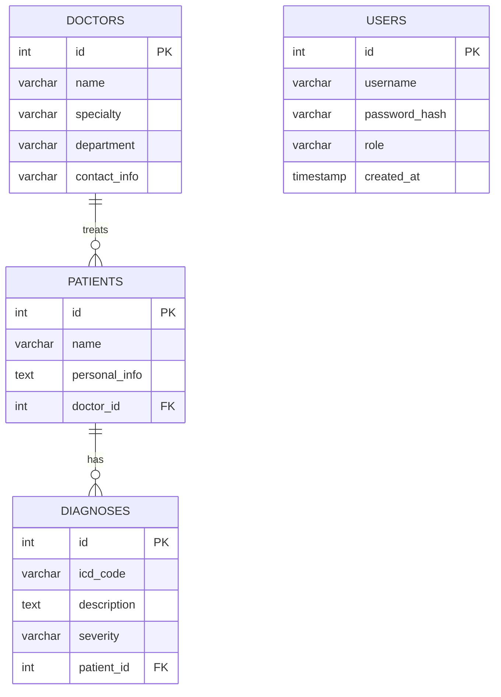

# ERD (B.P2)

```mermaid
erDiagram
  DOCTORS ||--o{ PATIENTS : treats
  PATIENTS ||--o{ DIAGNOSES : has

  DOCTORS {
    int id PK
    varchar name
    varchar specialty
    varchar department
    varchar contact_info
  }

  PATIENTS {
    int id PK
    varchar name
    text personal_info
    int doctor_id FK
  }

  DIAGNOSES {
    int id PK
    varchar icd_code
    text description
    varchar severity
    int patient_id FK
  }

  USERS {
    int id PK
    varchar username
    varchar password_hash
    varchar role
    timestamp created_at
  }
```
