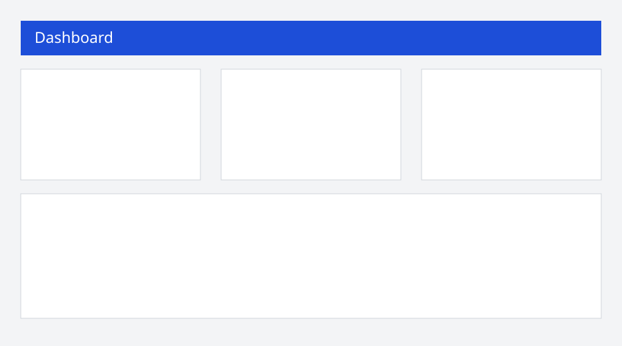
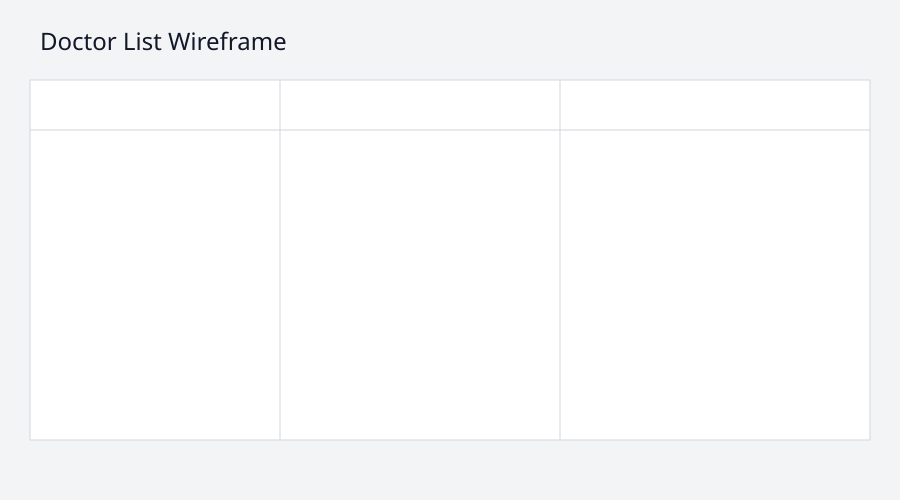
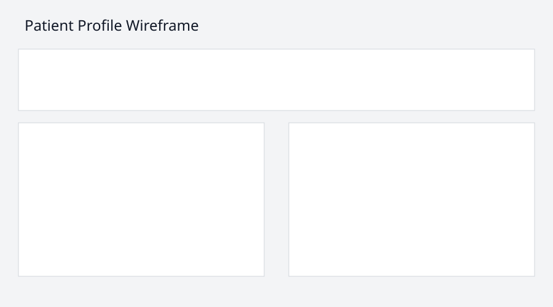
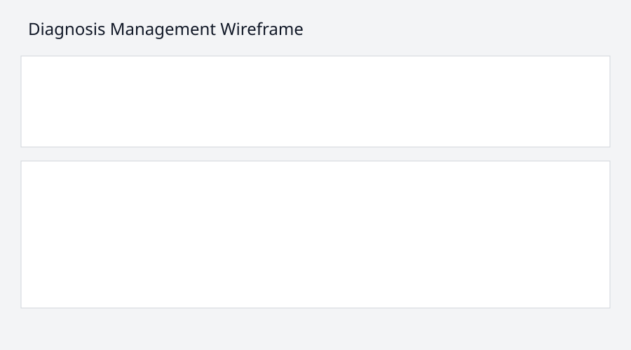

# Wireframes and Figma Evidence (B.P2)

The following wireframe screenshots are included as exported design images:

1. Dashboard

2. Doctor List

3. Patient Profile

4. Diagnosis Management

Figma design link placeholder: `https://www.figma.com/file/caretrack-tybt-designs`.
